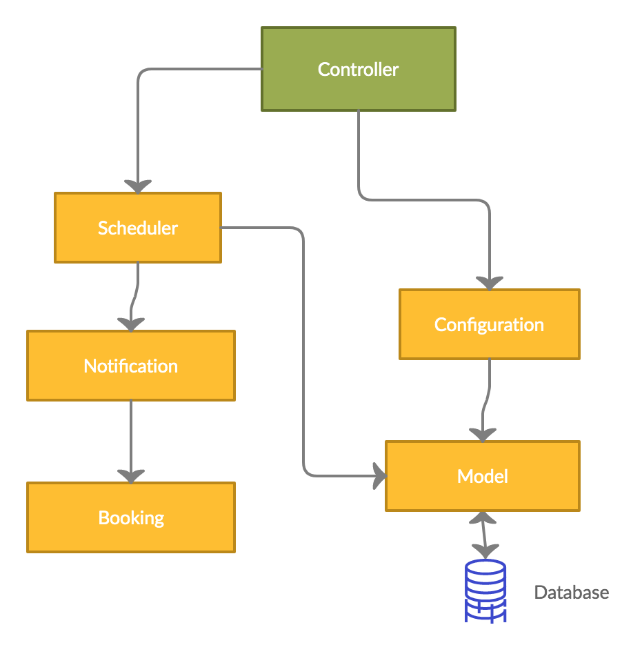

# Cocoa-bot :robot:

Cocoa is a Discord bot to schedule "coffee-breaks" for server members. You can use it just to chat with anyone that is interested to spend some time in a virtual "coffe-break" or to ask for help for a specific question and other types of meetings. The meetings are created with random people that are interested in the same goal for the meetings.

## Inspiration :star2:
Working remotely can be hard. But building social connections when working remotely is highly important. This could be quite challenging sometings: meeting new people that you don't communicate usually is a step out of the comfort zone. Cocoa makes this step a bit easier, now you can book a meeting with a new person to chat or to get help with your problem and this person could be anyone in your organization.

## Installation and setup :gear:
To add this bot to your server: ...

### Commands that you can use: :koala:
- [x] Getting started `cocoapls setup`
- [x] Schedule a new meeting `cocoapls schedule new`
- [x] Check-out what meetings have been scheduled`cocoapls list meetings`
- [x] Cancel the schedualed meetigns `schedule cancel`
- [x] Delete yourself from the database `cocoapls delete me`

## What's next::rocket:
- [ ] Integrate with google meet or other services for setting up meetings
- [ ] Add more commands and options like reacting with a sticker for a specific action.

 
## How we built it :space_invader: :computer:
For Cocoa we used _Python 3_ and the _pubic API for Discord_ and also _ProgreSQL_ for the dabase and _SQL Alchemy_ for working with the database.

## Architecture Diagram :octocat:

## Challenges we ran into :surfer:
- As in many hackathons the main challange we the time restriction. Building something meaningful in this short period of time while also dealing with other responsabilites that we have such as univeristy exams and laboratories was a real challenge.
- Focusing on the main features and not being too adventurous.
- Desingning the architecture while not knowing the whole posibilites of the Discord API, as we didn't have too much experience with it.

## Accomplishments that we're proud of :gem:
- [x] Creating a MVP in this minimal amount of time.
- [x] Following the best practices for the Git and Github
- [x] Being a great team and how fast we started helping each other in order to do more.

## What we learned :book:
- [x] Creating a clean backend architecture
- [x] Working with Discord API
- [x] Working with ProgreSQL and SQL Alchemy
- [x] Best practices for Clean code and Public API
